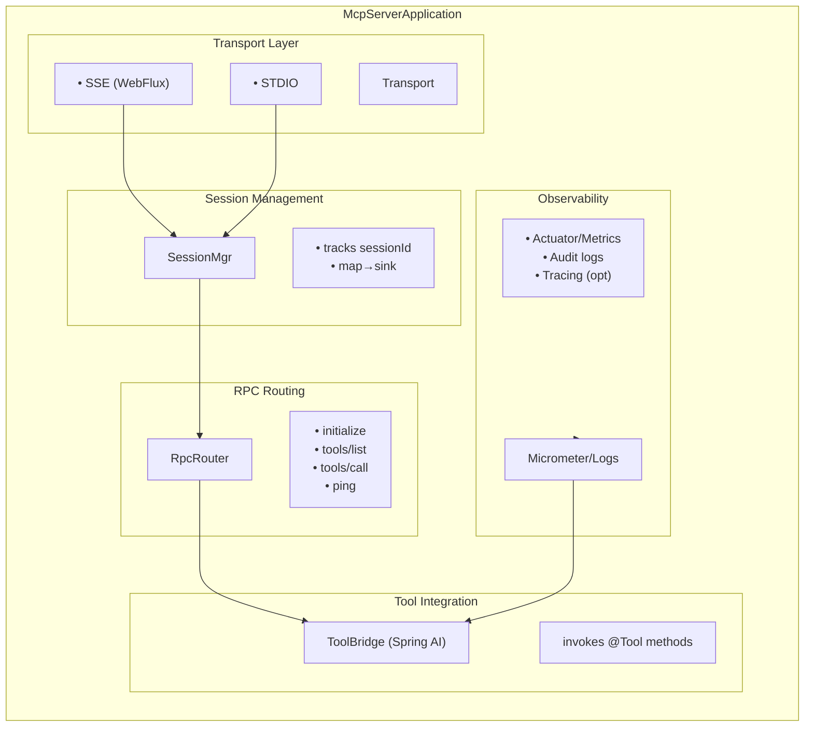

### MCP

MCP is a thin contract for LLM agents (clients) to discover and call **tools** exposed by a **server**. MCP itself is transport‑agnostic; payloads are **JSON‑RPC 2.0**.

#### JSON‑RPC 2.0 shapes (essentials)

- **Request**: `{ "jsonrpc":"2.0", "id":"<string|number>", "method":"<string>", "params":{...} }`
    
- **Response**: `{ "jsonrpc":"2.0", "id":"same-as-request", "result":{...} }`
    
- **Error**: `{ "jsonrpc":"2.0", "id":"same-as-request", "error": { "code": <int>, "message":"...", "data":{...}? } }`
    
- **Notification** (one‑way): `{ "jsonrpc":"2.0", "method":"<string>", "params":{...} }` (no `id`)
    
- **Batch** (optional): `[ {request1}, {request2}, ... ]` (keep it off until you truly need it).
    

#### MCP common methods

- `initialize` → the server returns `serverInfo` & `capabilities`.
    
- `notifications/initialized` → client confirms it’s ready.
    
- `tools/list` → list available tools and their arg specs.
    
- `tools/call` → invoke a tool with `name` + `arguments`.
    
- `ping` → optional, quick liveness check.
    

#### Error code conventions (recommended)

- `-32600` invalid request; `-32601` method not found; `-32602` invalid params; `-32603` internal error (JSON‑RPC reserved).
    
- **Proposed** app codes: `-32000` validation failed; `-32001` unauthorized; `-32002` upstream timeout; `-32003` conflict; `-32004` too many requests.
    

---

### Choosing a transport: STDIO vs SSE (deep dive)

|Aspect|STDIO|SSE (+ HTTP POST uplink)|
|---|---|---|
|Topology|Local child‑process|Networked (browser/gateway‑friendly)|
|Latency|Minimal|Low (depends on proxies)|
|Ops|Manage process lifecycle|Manage HTTP infra (CORS, timeouts)|
|Streaming|By framing|Natural via SSE events|
|Security boundary|Per‑executable sandbox|Web security (CORS/CSRF/SSRF, auth)|
|Best for|CLI/IDE/local agents|Web consoles, remote clients|

**Rule of thumb**: support **both**. Use STDIO for local agents/CLIs; use SSE for browsers and remote gateways.

---

### Server architecture (reference design)



Key interfaces:

- **SessionManager**: `sessionId → Sinks.Many<ServerEvent>` for SSE, plus per‑session inflight map.
    
- **RpcRouter**: parses JSON‑RPC and dispatches to handlers (`initialize`, `tools/list`, `tools/call`, …).
    
- **ToolBridge**: adapts JSON args to Spring AI `@Tool` methods, validates inputs, maps outputs.
    

---

### Spring Boot project (dependencies & config)

#### Maven (indicative)

```xml
<dependencies>
  <dependency>
    <groupId>org.springframework.boot</groupId>
    <artifactId>spring-boot-starter-webflux</artifactId>
  </dependency>
  <!-- Spring AI MCP starter (use your actual artifact/version) -->
  <!-- <dependency>org.springframework.ai:spring-ai-spring-boot-starter-mcp:x.y.z</dependency> -->

  <!-- Nacos (config + discovery as needed) -->
  <dependency>
    <groupId>com.alibaba.cloud</groupId>
    <artifactId>spring-cloud-starter-alibaba-nacos-config</artifactId>
  </dependency>
  <dependency>
    <groupId>com.alibaba.cloud</groupId>
    <artifactId>spring-cloud-starter-alibaba-nacos-discovery</artifactId>
  </dependency>

  <!-- Observability (optional but recommended) -->
  <dependency>
    <groupId>org.springframework.boot</groupId>
    <artifactId>spring-boot-starter-actuator</artifactId>
  </dependency>
  <dependency>
    <groupId>io.micrometer</groupId>
    <artifactId>micrometer-registry-prometheus</artifactId>
    <scope>runtime</scope>
  </dependency>

  <!-- lombok/jakarta as needed -->
</dependencies>
```

#### Application config (SSE mode)

```yaml
server:
  address: 127.0.0.1
  port: 8083

spring:
  application:
    name: nacos-mcp-server

  config:
    import: optional:nacos:${spring.application.name}.yaml?group=DEFAULT_GROUP

  cloud:
    nacos:
      server-addr: ${NACOS_ADDR:127.0.0.1:8848}
      username: ${NACOS_USER:nacos}
      password: ${NACOS_PASS:nacos}
      config:
        enabled: true
        refresh-enabled: true
        file-extension: yaml
        group: DEFAULT_GROUP
        namespace: ${NACOS_NS:}
      discovery:
        enabled: false

  ai:
    mcp:
      server:
        enabled: true
        type: ASYNC            # SSE downlink + POST uplink
        name: nacos-mcp
        version: 1.0.0
        sse-endpoint: /mcp/sse
        sse-message-endpoint: /mcp/message

logging:
  level:
    org.springframework.ai.mcp: DEBUG
    reactor.netty.http.server: DEBUG
```

#### 4.3 Reactor Netty client tuning (for upstream calls)

If your tools call remote services (e.g., other SSE endpoints), configure a bounded **connection pool** and explicit timeouts:

```java
package com.jasper.nacosmcp.config;

import io.netty.channel.ChannelOption;
import io.netty.handler.timeout.ReadTimeoutHandler;
import io.netty.handler.timeout.WriteTimeoutHandler;
import org.springframework.context.annotation.*;
import org.springframework.http.client.reactive.ReactorClientHttpConnector;
import org.springframework.web.reactive.function.client.WebClient;
import reactor.netty.http.client.HttpClient;
import reactor.netty.resources.ConnectionProvider;

import java.time.Duration;
import java.util.concurrent.TimeUnit;

@Configuration
public class WebClientConfig {
  @Bean
  public WebClient.Builder webClientBuilder() {
    ConnectionProvider pool = ConnectionProvider.builder("upstream-pool")
      .maxConnections(200)                 // tune per workload
      .pendingAcquireMaxCount(1000)
      .maxIdleTime(Duration.ofSeconds(30))
      .maxLifeTime(Duration.ofMinutes(5))
      .build();

    HttpClient http = HttpClient.create(pool)
      .option(ChannelOption.CONNECT_TIMEOUT_MILLIS, 4000)
      .doOnConnected(c -> c
        .addHandlerLast(new ReadTimeoutHandler(8, TimeUnit.SECONDS))
        .addHandlerLast(new WriteTimeoutHandler(8, TimeUnit.SECONDS)))
      .responseTimeout(Duration.ofSeconds(10));

    return WebClient.builder().clientConnector(new ReactorClientHttpConnector(http));
  }
}
```

**Why this matters**: prevents unbounded client sockets, enforces timeouts for tool calls, and avoids thread starvation.

---

### Tool metadata & REST mirror (for UIs)

Use a simple in‑memory registry to expose human‑readable tool specs while the JSON‑RPC layer remains the source of truth.

```java
package com.jasper.nacosmcp.meta;

public record ArgSpec(String name, String type, boolean required, String description, String example) {}
```

```java
package com.jasper.nacosmcp.meta;
import java.util.List;
public record ToolSpec(String name, String description, List<ArgSpec> args, String returns, String version) {}
```

```java
package com.jasper.nacosmcp.meta;

import org.springframework.stereotype.Component;
import jakarta.annotation.PostConstruct;
import java.util.*;

@Component
public class McpToolRegistry {
  private final Map<String, ToolSpec> registry = new LinkedHashMap<>();

  @PostConstruct
  void init() {
    registry.put("nacos.getConfig", new ToolSpec(
      "nacos.getConfig","Get Nacos config content",
      List.of(
        new ArgSpec("serverAddr","string",true,"Nacos server address","http://127.0.0.1:8848"),
        new ArgSpec("namespace","string",true,"Namespace","public"),
        new ArgSpec("dataId","string",true,"DataId","demo.yaml"),
        new ArgSpec("group","string",true,"Group","DEFAULT_GROUP")
      ),
      "{ content, type, md5?, lastModified? }","v1"));
    // ... publish/remove etc (see repo)
  }

  public Collection<ToolSpec> list() { return registry.values(); }
  public Optional<ToolSpec> get(String name) { return Optional.ofNullable(registry.get(name)); }
}
```

```java
package com.jasper.nacosmcp;

import com.jasper.nacosmcp.meta.McpToolRegistry;
import com.jasper.nacosmcp.meta.ToolSpec;
import lombok.RequiredArgsConstructor;
import org.springframework.web.bind.annotation.*;
import java.util.Collection;

@RestController
@RequestMapping("/mcp")
@RequiredArgsConstructor
public class McpMetaController {
  private final McpToolRegistry registry;
  @GetMapping("/tools") public Collection<ToolSpec> list(){ return registry.list(); }
  @GetMapping("/tools/{name}") public ToolSpec get(@PathVariable String name){
    return registry.get(name).orElseThrow(() -> new IllegalArgumentException("Unknown tool: "+name));
  }
}
```

---

### Implementing the RPC router (handlers & validation)

Create a small router that understands the few MCP methods you need and delegates tool calls to Spring AI’s `ToolCallbackProvider`.

```java
package com.jasper.nacosmcp.rpc;

import com.fasterxml.jackson.databind.JsonNode;
import com.fasterxml.jackson.databind.ObjectMapper;
import lombok.RequiredArgsConstructor;
import org.springframework.ai.tool.ToolCallbackProvider;
import org.springframework.stereotype.Component;
import reactor.core.publisher.Mono;

import java.util.Map;

@Component
@RequiredArgsConstructor
public class RpcRouter {
  private final ToolCallbackProvider tools;
  private final ObjectMapper om = new ObjectMapper();

  public Mono<JsonNode> route(JsonNode req) {
    String method = req.path("method").asText("");
    String id = req.has("id") ? req.get("id").asText() : null;

    try {
      return switch (method) {
        case "initialize" -> ok(id, Map.of(
          "serverInfo", Map.of("name","nacos-mcp","version","1.0.0"),
          "capabilities", Map.of("tools", true)
        ));
        case "notifications/initialized" -> ok(id, Map.of("ok", true));
        case "ping" -> ok(id, Map.of("pong", true));
        case "tools/list" -> ok(id, Map.of("tools", tools.listTools()));
        case "tools/call" -> handleToolCall(id, req);
        default -> error(id, -32601, "Method not found: "+method, null);
      };
    } catch (Throwable t) {
      return error(id, -32603, t.getMessage(), null);
    }
  }

  private Mono<JsonNode> handleToolCall(String id, JsonNode req) {
    String name = req.path("params").path("name").asText("");
    JsonNode argsNode = req.path("params").path("arguments");
    Map<String,Object> args = om.convertValue(argsNode, Map.class);
    return Mono.fromCallable(() -> tools.callTool(name, args))
      .map(res -> envelope(id, Map.of("name", name, "output", res)))
      .onErrorResume(ex -> error(id, -32000, "Tool invocation failed: "+ex.getMessage(), null));
  }

  private Mono<JsonNode> ok(String id, Object result) { return Mono.fromCallable(() -> envelope(id, result)); }
  private Mono<JsonNode> error(String id, int code, String msg, Object data){
    return Mono.fromCallable(() -> {
      var root = om.createObjectNode();
      root.put("jsonrpc","2.0"); if (id != null) root.put("id", id);
      var err = om.createObjectNode(); err.put("code", code); err.put("message", msg);
      if (data != null) err.set("data", om.valueToTree(data)); root.set("error", err); return root;
    });
  }
  private JsonNode envelope(String id, Object result){
    var root = om.createObjectNode(); root.put("jsonrpc","2.0"); if (id != null) root.put("id", id);
    root.set("result", om.valueToTree(result)); return root;
  }
}
```

---

### SSE transport (server‑side)

We’ll keep one **SSE stream per session** and a POST endpoint for uplink. The SSE stream first emits an `endpoint` event with a bound `sessionId`.

```java
package com.jasper.nacosmcp.sse;

import lombok.Value;
import org.springframework.http.MediaType;
import org.springframework.stereotype.Component;
import reactor.core.publisher.Sinks;

import java.util.Map;
import java.util.UUID;
import java.util.concurrent.ConcurrentHashMap;

@Component
public class SessionHub {
  @Value public static class Session { String id; Sinks.Many<String> sink; }
  private final Map<String, Session> sessions = new ConcurrentHashMap<>();

  public Session ensure(String id){
    return sessions.computeIfAbsent(id == null || id.isBlank()? UUID.randomUUID().toString(): id,
      sid -> new Session(sid, Sinks.many().multicast().onBackpressureBuffer()));
  }
  public Session get(String id){ return sessions.get(id); }
  public void remove(String id){ if (id!=null) sessions.remove(id); }
}
```

```java
package com.jasper.nacosmcp.sse;

import com.fasterxml.jackson.databind.JsonNode;
import com.fasterxml.jackson.databind.ObjectMapper;
import com.jasper.nacosmcp.rpc.RpcRouter;
import lombok.RequiredArgsConstructor;
import org.springframework.http.MediaType;
import org.springframework.http.codec.ServerSentEvent;
import org.springframework.stereotype.Controller;
import org.springframework.web.bind.annotation.*;
import reactor.core.publisher.Flux;
import reactor.core.publisher.Mono;

import java.net.URI;

@Controller
@RequestMapping("/mcp")
@RequiredArgsConstructor
public class SseController {
  private final SessionHub hub;
  private final RpcRouter router;
  private final ObjectMapper om = new ObjectMapper();

  @GetMapping(path = "/sse", produces = MediaType.TEXT_EVENT_STREAM_VALUE)
  public Flux<ServerSentEvent<String>> sse(@RequestParam(value = "sessionId", required = false) String sid){
    var sess = hub.ensure(sid);
    // 1) emit endpoint event immediately
    String endpoint = "/mcp/message?sessionId=" + sess.getId();
    var head = ServerSentEvent.<String>builder(endpoint).event("endpoint").build();

    // 2) keep streaming messages from sink
    var body = sess.getSink().asFlux().map(data -> ServerSentEvent.<String>builder(data).event("message").build());
    return Flux.concat(Flux.just(head), body).doFinally(s -> hub.remove(sess.getId()));
  }

  @PostMapping(path = "/message", consumes = MediaType.APPLICATION_JSON_VALUE)
  public Mono<Void> post(@RequestParam("sessionId") String sid, @RequestBody String json){
    var sess = hub.ensure(sid);
    return router.route(om.readTree(json))
      .map(om::writeValueAsString)
      .doOnNext(payload -> sess.getSink().tryEmitNext(payload))
      .then();
  }
}
```

#### Heartbeats & reconnects

- Send a **comment** event or `ping` notification every 15–30s (Nginx/Ingress idle timeout).
    
- Browser should **auto‑reconnect** EventSource; preserve `sessionId` and resume.
    

#### Client reference (browser)

```html
<script>
let postUrl, sessionId;
let inflight = new Map();

function connect(base = location.origin, sid) {
  const url = sid ? `${base}/mcp/sse?sessionId=${encodeURIComponent(sid)}` : `${base}/mcp/sse`;
  const es = new EventSource(url);
  es.addEventListener('endpoint', (e) => {
    postUrl = base.replace(/\/$/,'') + e.data; // /mcp/message?sessionId=...
    sessionId = new URL(postUrl, base).searchParams.get('sessionId');
  });
  es.addEventListener('message', (e) => {
    const msg = JSON.parse(e.data);
    if (msg.id && inflight.has(msg.id)) { inflight.get(msg.id).resolve(msg); inflight.delete(msg.id); }
    console.log('SSE', msg);
  });
  es.addEventListener('error', () => setTimeout(()=>connect(base, sessionId), 1500));
}

async function send(body){
  if (!postUrl) throw new Error('endpoint not ready');
  const id = body.id || ('c-' + Date.now()); body.id = id;
  const p = new Promise((resolve,reject) => inflight.set(id, {resolve,reject}));
  await fetch(postUrl, { method:'POST', headers:{'Content-Type':'application/json'}, body: JSON.stringify(body)});
  return p;
}

connect();
// handshake
send({ jsonrpc:'2.0', id:'init', method:'initialize', params:{ clientInfo:{name:'console',version:'0.1'}, protocolVersion:'2024-11-05' } });
</script>
```

---

### STDIO transport (server‑side)

Implement a robust **LSP‑style** framing parser (`Content-Length: N\r\n\r\n{json}`) and dispatch to the same `RpcRouter`.

```java
package com.jasper.nacosmcp.stdio;

import com.fasterxml.jackson.databind.JsonNode;
import com.fasterxml.jackson.databind.ObjectMapper;
import com.jasper.nacosmcp.rpc.RpcRouter;
import lombok.RequiredArgsConstructor;

import java.io.*;
import java.nio.charset.StandardCharsets;
import java.util.Locale;

@RequiredArgsConstructor
public class StdioServer {
  private final RpcRouter router;
  private final ObjectMapper om = new ObjectMapper();

  public void run(InputStream in, OutputStream out) throws Exception {
    var bin = new BufferedInputStream(in); var bout = new BufferedOutputStream(out);
    while (true) {
      int len = readContentLength(bin); if (len < 0) return; // EOF
      byte[] body = bin.readNBytes(len); JsonNode req = om.readTree(body);
      JsonNode rsp = router.route(req).block(); byte[] payload = om.writeValueAsBytes(rsp);
      byte[] header = ("Content-Length: "+payload.length+"\r\n\r\n").getBytes(StandardCharsets.US_ASCII);
      bout.write(header); bout.write(payload); bout.flush();
    }
  }

  private int readContentLength(InputStream in) throws IOException {
    String line; int len = -1; StringBuilder sb = new StringBuilder();
    while ((line = readLine(in)) != null) {
      if (line.isEmpty()) break; // header end
      String key = line.split(":",2)[0].trim().toLowerCase(Locale.ROOT);
      if ("content-length".equals(key)) len = Integer.parseInt(line.split(":",2)[1].trim());
    }
    return len;
  }
  private String readLine(InputStream in) throws IOException {
    StringBuilder sb = new StringBuilder(); int c; boolean seenCR = false;
    while ((c = in.read()) != -1) {
      if (c == '\r') { seenCR = true; continue; }
      if (seenCR && c == '\n') break; sb.append((char)c); seenCR = false;
    }
    return (c == -1 && sb.length()==0) ? null : sb.toString();
  }
}
```

Launcher:

```java
public class Main {
  public static void main(String[] args) throws Exception {
    var ctx = new org.springframework.boot.builder.SpringApplicationBuilder(com.jasper.nacosmcp.McpApplication.class).web(org.springframework.boot.WebApplicationType.NONE).run(args);
    var router = ctx.getBean(com.jasper.nacosmcp.rpc.RpcRouter.class);
    new com.jasper.nacosmcp.stdio.StdioServer(router).run(System.in, System.out);
  }
}
```

**Concurrency**: for STDIO, keep it **serial** unless you implement request multiplexing. Most clients expect ordered replies.

---

### Tool implementation (Nacos examples)

See your provided `NacosTools` class. Key patterns:

- Centralize default `spring.cloud.nacos.*` settings.
    
- Support **namespace override** with local client caches to avoid churn.
    
- Validate presence of required args; translate `NacosException` to JSON‑RPC errors with helpful messages.
    

**Extra sample tool** (echo & validate):

```java
@Tool(description = "Echo back arguments after basic validation")
public Map<String,Object> echo(@ToolParam(description="payload") Map<String,Object> payload){
  if (payload == null || payload.isEmpty()) throw new IllegalArgumentException("payload empty");
  return Map.of("ok",true, "size", payload.size(), "payload", payload);
}
```

---

### Validation & schema (making tools self‑describing)

- Use `ArgSpec`/`ToolSpec` to generate a **client‑side form** (like your HTML console).
    
- Optionally attach **JSON Schema** per tool to drive validation in UI:
    

```json
{
  "$schema":"https://json-schema.org/draft/2020-12/schema",
  "type":"object",
  "properties":{
    "dataId": {"type":"string", "minLength":1},
    "group":  {"type":"string", "default":"DEFAULT_GROUP"},
    "timeoutMs":{"type":"integer", "minimum": 0}
  },
  "required":["dataId"],
  "additionalProperties": false
}
```

---

### Reliability: idempotency, inflight control, retries

- **Idempotency**: treat `id` as dedupe key; keep an LRU (e.g., Caffeine) of recent ids and their results, so client retries don’t duplicate mutations.
    
- **Inflight caps**: per session, cap to N concurrent `tools/call`. Reject with `-32004` when exceeded.
    
- **Server timeouts**: wrap tool calls with timeouts/circuit breakers (Resilience4j) to avoid pile‑ups.
    

---

### Security hardening

- **CORS**: restrict origins; allow only necessary methods/headers; expose SSE headers.
    
- **CSRF**: for browser POSTs, require a token or same‑site cookie strategy (if the server hosts the UI, same‑origin mitigates much risk).
    
- **SSRF**: if any tool performs HTTP calls, enforce allow‑lists; deny RFC1918 by default unless explicitly permitted.
    
- **AuthN/Z**: if multi‑tenant, propagate `tenantId` in session context; per‑tool ACLs.
    
- **Audit**: log `when/who/sessionId/id/method/args(redacted)/duration/resultCode`.
    

**CORS config example**:

```java
@Bean
public WebFluxConfigurer corsConfigurer(){
  return new WebFluxConfigurer() {
    @Override public void addCorsMappings(CorsRegistry r){
      r.addMapping("/mcp/**")
       .allowedOrigins("https://your.console.example")
       .allowedMethods("GET","POST")
       .allowedHeaders("Content-Type")
       .allowCredentials(true)
       .maxAge(3600);
    }
  };
}
```

---

### Observability (metrics, logs, tracing)

**Micrometer timers around tool calls**:

```java
import io.micrometer.core.instrument.MeterRegistry;

@Component
@RequiredArgsConstructor
public class ToolMetrics {
  private final MeterRegistry meter;
  public <T> T timed(String tool, java.util.concurrent.Callable<T> fn) throws Exception {
    long t0 = System.nanoTime(); boolean ok = true; try { return fn.call(); }
    catch (Exception e){ ok=false; throw e; }
    finally { long ms=(System.nanoTime()-t0)/1_000_000L;
      meter.counter("mcp.tool.calls", "tool", tool, "ok", String.valueOf(ok)).increment();
      meter.timer("mcp.tool.latency", "tool", tool).record(ms, java.util.concurrent.TimeUnit.MILLISECONDS);
    }
  }
}
```

**Log correlation**: put `sessionId` and `id` into MDC for every request; configure JSON logging for log pipelines.

---

### Testing (unit, integration, contract)

- **Unit**: `RpcRouter` routes and error mapping; `NacosTools` with mocked clients.
    
- **Integration**: `WebTestClient` for `/mcp/message`; Reactor `StepVerifier` for SSE stream.
    
- **Contract**: JSON‑RPC schemas for requests/responses; run a compatibility suite.
    

`WebTestClient` sample:

```java
@SpringBootTest(webEnvironment = SpringBootTest.WebEnvironment.RANDOM_PORT)
class RpcIntegrationTests {
  @Autowired WebTestClient http;
  @Test void listTools() {
    http.post().uri("/mcp/message?sessionId=test")
      .contentType(MediaType.APPLICATION_JSON)
      .bodyValue("{\"jsonrpc\":\"2.0\",\"id\":\"ls\",\"method\":\"tools/list\",\"params\":{}}")
      .exchange().expectStatus().isOk();
  }
}
```

---

### Deployment notes (Nginx/Ingress/K8s)

- **Nginx**: disable proxy buffering for SSE; increase `proxy_read_timeout` beyond your heartbeat.
    
- **Ingress**: set `nginx.ingress.kubernetes.io/proxy-read-timeout: "3600"` and `.../proxy-send-timeout` similarly.
    
- **K8s**: add liveness/readiness; set resource requests/limits; HPA on CPU + RPS; prefer **sticky sessions not required** (sessionId is in query param).
    

---

### Advanced patterns

- **Progress streaming**: send multiple `message` events per request id (include `partial:true` flag) and a final completion.
    
- **Cancellation**: support `notifications/cancel { id: <reqId> }` and cooperatively cancel long tool calls.
    
- **Pagination**: tools that list large datasets should accept `page/size` and stream pages.
    
- **Batch support**: only if you can keep ordering and partial failure semantics clear in UI.
    

---

### Bring‑up & production checklist

-  End‑to‑end: `initialize → notifications/initialized → tools/list → tools/call` verified.
    
-  SSE endpoint emission → POST binding by `sessionId` works; reconnection stable.
    
-  Per‑tool validation + structured error codes.
    
-  Upstream timeouts, pools, retries; circuit breakers on flaky services.
    
-  Per‑session inflight caps; global rate limiter.
    
-  CORS/CSRF/SSRF hardened; auth in place if multi‑tenant.
    
-  Audit logs redacting secrets.
    
-  Actuator + Micrometer shipped; dashboard shows success rate, P95, error budget.
    
-  STDIO mode packaged & launchable; lifecycle scripts ready.
    
-  Load‑test with SSE fan‑out and tool latency distributions.