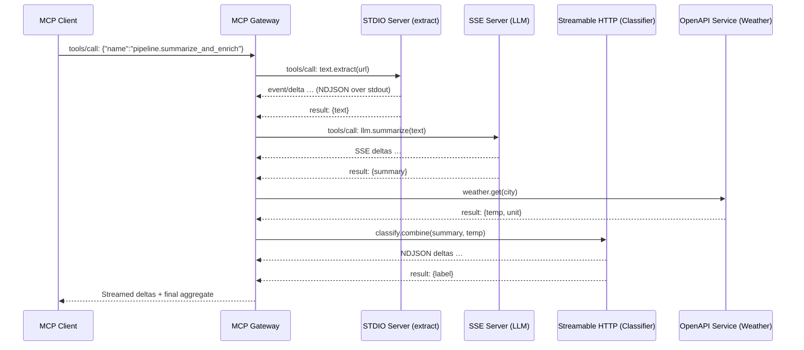

### 1. MCP in Brief (Conceptual Model)

- **Roles**: An **MCP client** (agent/runtime/gateway) connects to one or more **MCP servers** that expose tools/resources.
    
- **Message Shape**: Typically JSON‑encoded request/response (often JSON‑RPC‑like), optionally **incremental/streaming** via deltas or event frames.
    
- **Discovery**: Servers enumerate available tools/resources (e.g., `tools/list`, `resources/list`) with JSON Schemas for validation.
    
- **Transport Agnosticism**: The protocol payload is transport‑independent. This enables uniform orchestration across STDIO, SSE, chunked HTTP, and OpenAPI adapters.
    

> **Unifying idea**: Normalize all transports to a **canonical envelope** inside the gateway:

```json
{
  "jsonrpc": "2.0",
  "id": 42,
  "method": "tools/call",
  "params": {
    "name": "web.search",
    "arguments": { "q": "anthropic mcp" }
  }
}
```

---

### 2. Taxonomy of MCP Server Types

#### 2.1 STDIO Process Servers

**Definition**: Long‑running child process launched by the gateway; messages are exchanged over **stdout/stdin** (pipes).

**Characteristics**

- **Framing**: Common patterns include newline‑delimited JSON (NDJSON), JSON with explicit length prefixes, or JSON‑RPC over STDIO.
    
- **Lifecycle**: Gateway owns process lifecycle (spawn, restart on crash, exponential back‑off).
    
- **Backpressure**: OS pipe buffering; writing too fast can block. Use async I/O and bounded queues.
    
- **Security**: Local trust boundary; sandboxing via OS users/containers. Avoid executing untrusted binaries.
    

**Minimal Handshake (illustrative)**

```text
<server stdout> {"jsonrpc":"2.0","id":1,"method":"initialize","params":{"server":"my-stdio"}}
<gateway stdin>  {"jsonrpc":"2.0","id":1,"result":{"ok":true}}
```

**Example: Tool call over NDJSON**

```text
# gateway → stdio server
{"id":10,"jsonrpc":"2.0","method":"tools/call","params":{"name":"text.extract","arguments":{"url":"https://example.com"}}}
# server → gateway (partial streaming)
{"jsonrpc":"2.0","method":"event/delta","params":{"id":10,"delta":"Paragraph 1..."}}
{"jsonrpc":"2.0","method":"event/delta","params":{"id":10,"delta":"Paragraph 2..."}}
{"jsonrpc":"2.0","id":10,"result":{"text":"Paragraph 1...\nParagraph 2..."}}
```

---

#### 2.2 SSE Endpoint Servers (HTTP `text/event-stream`)

**Definition**: Gateway opens a long‑lived **GET** connection; server pushes **SSE frames** (`event:`, `data:`) until completion.

**Characteristics**

- **Framing**: RFC‑compliant SSE lines separated by blank lines. Each frame can carry JSON payload in `data:`.
    
- **Bidirectionality**: Typically **server→client** only; **client→server** commands sent via side‑channel (e.g., POST) or query params.
    
- **Reliability**: Heartbeats (comments `:\n`), **reconnect** with `Last-Event-ID`.
    
- **Security**: HTTPS, CORS, auth headers or cookies.
    

**Example: SSE stream**

```http
GET /mcp/stream HTTP/1.1
Accept: text/event-stream
Authorization: Bearer <token>

HTTP/1.1 200 OK
Content-Type: text/event-stream

: heartbeat\n\n
event: initialized\n
data: {"server":"my-sse"}\n\n
event: message\n
data: {"jsonrpc":"2.0","id":99,"method":"event/delta","params":{"delta":"Hello"}}\n\n
event: complete\n
data: {"id":99,"status":"ok"}\n\n
```

**Client→Server command (side channel)**

```http
POST /mcp/command
Content-Type: application/json

{"jsonrpc":"2.0","id":99,"method":"tools/call","params":{"name":"translate","arguments":{"text":"你好"}}}
```

---

#### 2.3 Streamable HTTP Servers (chunked/NDJSON/HTTP‑2)

**Definition**: Standard HTTP endpoints that emit **incremental chunks** in the response body (e.g., **NDJSON lines** or **HTTP/1.1 chunked**; HTTP/2 streaming). Unlike SSE, no `event:` prefix.

**Characteristics**

- **Framing**: NDJSON (`\n`‑delimited JSON), or length‑prefixed chunks. Content‑Type often `application/x-ndjson`.
    
- **Bidirectionality**: Request provides full command;  
    response streams back deltas and a final summary.
    
- **Interoperability**: Plays well with proxies; fewer CORS quirks than SSE in some stacks.
    

**Example: NDJSON streaming**

```http
POST /mcp
Content-Type: application/json

{"id":7,"jsonrpc":"2.0","method":"tools/call","params":{"name":"code.search","arguments":{"q":"mcp"}}}

HTTP/1.1 200 OK
Content-Type: application/x-ndjson

{"jsonrpc":"2.0","method":"event/delta","params":{"id":7,"delta":"file1: ..."}}
{"jsonrpc":"2.0","method":"event/delta","params":{"id":7,"delta":"file2: ..."}}
{"jsonrpc":"2.0","id":7,"result":{"matches":2}}
```

---

#### 2.4 OpenAPI‑Described Services (Adapter Pattern)

**Definition**: A conventional REST service with an **OpenAPI** spec is **adapted** to MCP by mapping operations to MCP tools. The gateway performs **schema translation** and **IO normalization**.

**Characteristics**

- **Discovery**: Parse OpenAPI to produce MCP `tools/list`, generating JSON Schemas for arguments/results.
    
- **Invocation**: Gateway invokes HTTP operations (GET/POST/PUT/…) and converts the response into MCP result frames (optionally streaming if server supports it).
    
- **Validation**: Input arguments validated against OpenAPI parameter schema.
    

**Example: OpenAPI → MCP tool mapping**

```yaml
# OpenAPI (excerpt)
paths:
  /weather:
    get:
      parameters:
        - in: query
          name: city
          schema: { type: string }
      responses:
        '200':
          content:
            application/json:
              schema:
                type: object
                properties: { temp: {type: number}, unit: {type: string} }
```

Mapped tool:

```json
{
  "name":"weather.get",
  "description":"Get current weather by city",
  "input_schema":{"type":"object","properties":{"city":{"type":"string"}},"required":["city"]},
  "output_schema":{"type":"object","properties":{"temp":{"type":"number"},"unit":{"type":"string"}}}
}
```

Invocation (gateway internal):

```http
GET /weather?city=Tokyo HTTP/1.1
Accept: application/json
```

Result normalized to MCP:

```json
{"jsonrpc":"2.0","id":12,"result":{"temp":30.1,"unit":"C"}}
```

---

### 3. Cross‑Transport Interoperability via a Gateway

#### 3.1 Unifying Envelope & Normalization

A gateway should convert all incoming/outgoing traffic to a **canonical envelope**:

- **Requests**: `{jsonrpc,id,method,params}`
    
- **Deltas**: `{method:"event/delta", params:{id, delta}}`
    
- **Final**: `{id, result}` or `{id, error}`
    

This enables mixing STDIO, SSE, chunked HTTP, and OpenAPI servers in a single plan.

#### 3.2 Sequence Diagram: Heterogeneous Orchestration



---

### 4. Worked Example: Data Passing Between Servers

**Scenario**: Build a 3‑step pipeline across different transports.

1. **STDIO** (`text.extract`) → 2) **SSE** (`llm.summarize`) → 3) **OpenAPI** (`weather.get`) → 4) **Streamable HTTP** (`compose.report`).
    

#### 4.1 Step 1 — STDIO extraction

**Request (gateway → STDIO)**

```json
{"jsonrpc":"2.0","id":101,"method":"tools/call","params":{"name":"text.extract","arguments":{"url":"https://example.com/post"}}}
```

**Streamed deltas (server → gateway)**

```text
{"jsonrpc":"2.0","method":"event/delta","params":{"id":101,"delta":"Intro paragraph…"}}
{"jsonrpc":"2.0","method":"event/delta","params":{"id":101,"delta":"Method section…"}}
```

**Final**

```json
{"jsonrpc":"2.0","id":101,"result":{"text":"Intro paragraph…\nMethod section…"}}
```

#### 4.2 Step 2 — SSE summarization

**Command side‑channel (gateway → SSE `POST /command`)**

```json
{"jsonrpc":"2.0","id":102,"method":"tools/call","params":{"name":"llm.summarize","arguments":{"text":"Intro…Method…"}}}
```

**SSE stream (SSE `GET /stream`)**

```text
event: message
data: {"jsonrpc":"2.0","method":"event/delta","params":{"id":102,"delta":"Summary sentence 1."}}

event: message
data: {"jsonrpc":"2.0","method":"event/delta","params":{"id":102,"delta":" Summary sentence 2."}}

event: complete
data: {"id":102,"status":"ok"}
```

**Final (internally assembled)**

```json
{"jsonrpc":"2.0","id":102,"result":{"summary":"Summary sentence 1. Summary sentence 2."}}
```

#### 4.3 Step 3 — OpenAPI enrichment

**Gateway → OpenAPI**

```http
GET /weather?city=Tokyo HTTP/1.1
Accept: application/json
```

**OpenAPI → Gateway**

```json
{"temp":30.1,"unit":"C"}
```

**Normalized result**

```json
{"jsonrpc":"2.0","id":103,"result":{"temp":30.1,"unit":"C"}}
```

#### 4.4 Step 4 — Streamable HTTP composition

**Gateway → Streamable HTTP NDJSON**

```http
POST /mcp
Content-Type: application/json

{"jsonrpc":"2.0","id":104,"method":"tools/call","params":{"name":"compose.report","arguments":{"summary":"…","weather":{"temp":30.1,"unit":"C"}}}}
```

**Server → Gateway NDJSON deltas**

```text
{"jsonrpc":"2.0","method":"event/delta","params":{"id":104,"delta":"Report title…"}}
{"jsonrpc":"2.0","method":"event/delta","params":{"id":104,"delta":" Report body…"}}
{"jsonrpc":"2.0","id":104,"result":{"doc_url":"https://files.local/report-abc"}}
```

**Gateway → Client (aggregated)**: Streams the same deltas and returns final `doc_url`.

---

### 5. Reliability, Flow Control, and Error Handling

- **Heartbeats**: For SSE, send comment frames (`:\n`); for chunked streams, periodic zero‑value deltas.
    
- **Backpressure**:
    
    - STDIO: monitor pipe fullness; don’t write faster than consumer can read; use async I/O.
        
    - HTTP Streams: set bounded buffer; apply flow control on per‑connection basis; propagate `Retry‑After`.
        
- **Retries & Idempotency**: Assign stable `id` and tool arguments; make OpenAPI calls idempotent where possible (`GET` preferred for read ops).
    
- **Timeouts**: Per tool and per transport; cancel via gateway and send `cancel` messages to servers that support it.
    
- **Errors**: Normalize to `{id, error:{code, message, data}}`. Preserve transport‑specific metadata (HTTP status, stderr excerpts) in `data`.
    

---

### 6. Security Considerations

- **Auth**: Bearer tokens/OIDC for HTTP(S); OS‑level isolation for STDIO; never pass secrets inside deltas.
    
- **CORS**: For browser‑facing SSE/HTTP, set explicit origins; prefer same‑site cookies or Authorization headers.
    
- **Least Privilege**: Scope tokens per server; rotate regularly.
    
- **Validation**: Enforce JSON Schema on inputs; sanitize output before invoking downstream tools.
    

---

### 7. Observability & Tooling

- **Structured Logs**: Log each frame with `trace_id`, `tool_name`, `latency_ms`.
    
- **Metrics**: Counters for requests, deltas, errors; histograms for latency/bytes.
    
- **Tracing**: Propagate `traceparent` across STDIO (headers emulated), SSE (pseudo‑headers in JSON), HTTP (real headers).
    

---

### 8. Pros/Cons Summary

|Modality|Pros|Cons|Typical Use|
|---|---|---|---|
|**STDIO**|Simple local deployment; low overhead; language‑agnostic binaries|Process mgmt; pipe backpressure; local‑only unless tunneled|Plugins, CLI tools wrapped as MCP|
|**SSE**|Native push streaming; simple browser support|Client→server channel needs POST; proxies may buffer|LLM deltas, token streams|
|**Streamable HTTP**|Works well with proxies/CDNs; single request for cmd+stream|Slightly more parsing logic; browser APIs vary|Classifiers, long‑running jobs with NDJSON updates|
|**OpenAPI Adapter**|Leverages existing REST ecosystems; strong schema|Not inherently streaming (unless server supports); mapping complexity|Enterprise systems, SaaS APIs|

---

### 9. Implementation Notes (Gateway‑Side)

- **Connection Management**:
    
    - STDIO: exponential back‑off restarts; detect zombie children.
        
    - SSE: auto‑reconnect with `Last-Event-ID`; jittered retry intervals.
        
    - HTTP Streams: honor `Transfer‑Encoding: chunked`; flush after each frame.
        
- **Schema**: Cache tool metadata; re‑resolve on server reconnect.
    
- **Safety**: Quarantine malformed frames; circuit‑break noisy servers.
    

---

### 10. Quick Reference: Frame Templates

**Canonical Request**

```json
{"jsonrpc":"2.0","id":1,"method":"tools/call","params":{"name":"<tool>","arguments":{}}}
```

**Delta Event**

```json
{"jsonrpc":"2.0","method":"event/delta","params":{"id":1,"delta":"…"}}
```

**Final Result**

```json
{"jsonrpc":"2.0","id":1,"result":{}}
```

**Error**

```json
{"jsonrpc":"2.0","id":1,"error":{"code":"E_TOOL_FAIL","message":"…","data":{"transport":"sse","status":502}}}
```

---

#### Appendix: Minimal Pseudocode (Gateway Normalizer)

```python
# Pseudocode: normalize incoming frames from any transport
async def handle_frame(raw: bytes, transport: str):
    if transport == 'sse':
        payload = json.loads(extract_sse_data(raw))
    elif transport == 'stdio-ndjson':
        payload = json.loads(raw)
    elif transport == 'http-ndjson':
        payload = json.loads(raw)
    else:
        raise ValueError('unknown transport')

    if 'method' in payload and payload['method'] == 'event/delta':
        route_delta(payload['params']['id'], payload['params']['delta'])
    elif 'result' in payload:
        complete_request(payload['id'], payload['result'])
    elif 'error' in payload:
        fail_request(payload['id'], payload['error'])
    else:
        log.warn('unrecognized frame', payload)
```